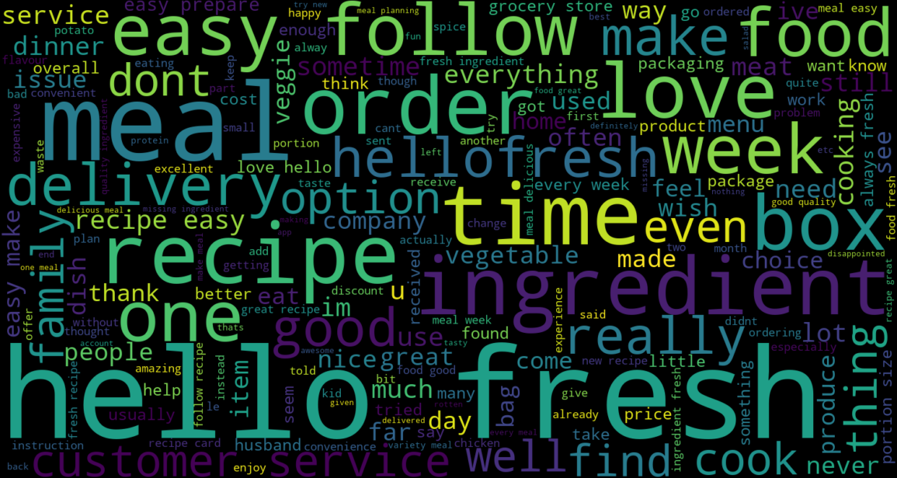

# Hello-Fresh Canada Review Metrics
## Table of Contents
<!-- @import "[TOC]" {cmd="toc" depthFrom=1 depthTo=6 orderedList=false} -->

<!-- code_chunk_output -->

- [Students' Graduation Rate Prediction](#students-graduation-rate-prediction)
  - [Table of Contents](#table-of-contents)
  - [Problem description](#problem-description)
    - [Project Folder Structure](#project-folder-structure)
    - [About this dataset](#about-this-dataset)
    - [Data Dictionary](#data-dictionary)
    - [Domain area research](#domain-area-research)
  - [Preprocessing and Data Cleaning](#preprocessing-and-data-cleaning)
    - [Data Processing Steps](#data-processing-steps)
        - [Data Ingestion](#Data-Ingestion)
        - [Duplicate Removal and Missing Values Handling](#duplicate-removal-and-missing-values-handling)
        - [Text Cleaning and Preprocessing](#text-cleaning-and-preprocessing)
        - [Sentiment Analysis](#sentiment-analysis)
        - [Categorization of Sentiment Scores](#categorization-of-sentiment-scores)
        - [Splitting Data into Reference and Current Sets](#splitting-data-into-reference-and-current-sets)

  - [Sentiment Analysis Visualization](#preprocessing-and-data-cleaning)
       - [1. Word Cloud](#1-word-cloud)
       - [2. Average Monthly Rate](#2-average-monthly-rate)
       - [3. Compound Sentiment Scores vs. Rating](#3-compound-sentiment-scores-vs-rating)
  - [End-to-End Model Orchestration Flow with Prefect](#end-to-end-model-orchestration-flow-with-prefect)

  - [Model Experimentation with MLflow](#model-experimentation-with-mlflow)
    - [Training and Evaluating Random Forest Model](#training-and-evaluating-random-forest-model)
    - [Predicting Current Data Batch](#predicting-current-data-batch)
  - [Project Monitoring and Dashboard Creation with Evidently](#project-monitoring-and-dashboard-creation-with-evidently)

    - [Data Quality Report Creation](#data-quality-report-creation)
    - [Data Drift Test Suite Creation](#data-drift-test-suite-creation)
    - [Project Creation and Dashboard Configuration](#project-creation-and-dashboard-configuration)
    - [Metrics and Tests](#metrics-and-tests)
    - [Dashboard Panels](#dashboard-panels)
  
  - [Conclusions](#conclusions)
  - [References](#references)

## Problem description

The project aims to analyze customer sentiment towards HelloFresh Canada by examining reviews collected from Trustpilot. The primary objective is to understand customer perceptions and sentiments from 2019 to 2024. By analyzing sentiment trends, the project seeks to provide insights that can help HelloFresh Canada identify areas for improvement, enhance customer satisfaction, and improve their service offerings.

The analysis involves cleaning and preprocessing the data, performing sentiment analysis using the VADER sentiment analysis tool, and training a Random Forest model to classify customer reviews based on sentiment. The project also includes visualizing trends in reviewer ratings over the years to identify shifts in customer sentiment.


## Dataset

The dataset used in this project consists of customer reviews scraped from the Trustpilot website for HelloFresh Canada. The data collection process involved using Selenium WebDriver with Python to automate the extraction of reviews. The key components of the dataset are as follows:

- **Review Dates**: The dates when the reviews were posted. This information is crucial for analyzing sentiment trends over time.

- **Review Content**: The full text of the customer reviews, containing the opinions and experiences shared by customers.

- **Review Headers**: Brief titles or summaries provided by customers, offering a quick insight into the review's content.

- **Review Ratings**: Numerical ratings provided by customers, typically ranging from 1 to 5 stars, representing their level of satisfaction.


## Preprocessing and Data Cleaning

### Data Processing Steps:

- #### Data Ingestion: The dataset is loaded from a CSV file into a DataFrame for processing.

- #### Duplicate Removal and Missing Values Handling:
  - Duplicate reviews based on content are removed to ensure data integrity.
  - Reviews with missing content are dropped to maintain dataset quality.

- #### Text Cleaning and Preprocessing**:
  - Text is converted to lowercase to standardize it.
  - Special characters, punctuation, and symbols are removed using regular expressions.
  - The text is tokenized into individual words.
  - Common stopwords are eliminated to focus on meaningful words.
  - Words are lemmatized to their base form to reduce variations.
  - New features are created, including word counts for content and headers, and date formatting.

- #### Sentiment Analysis:
  - Sentiment scores are calculated using the VADER (Valence Aware Dictionary and Sentiment Reasoner) tool from NLTK.
  - Scores include compound, negative, neutral, and positive sentiments.
  - Sentiment scores are applied to both review content and headers.

- #### Categorization of Sentiment Scores:
  - Sentiment scores are categorized into 'positive', 'neutral', or 'negative' based on the compound score.

- #### Splitting Data into Reference and Current Sets:
  - The dataset is split into historical (reference) and recent (current) data based on a specified date.
  - The current data is sorted by a specified column, if available.

## Sentiment Analysis Visualization
### 1. Word Cloud



- Shows the most frequently occurring words in the cleaned review content.
  - Words appear in varying sizes, with larger words representing higher frequency.
  - **Keyword Insights**: Helps identify common themes and key terms mentioned by customers.
  - **Content Analysis**: Useful for understanding the focus of customer feedback and for guiding further content or sentiment analysis.
### 2. Average Monthly Rate
- This chart displays the average monthly rating for each year combined into a single plot.
  
  - **Trend Analysis**: Helps identify trends in average ratings over time.
  - **Seasonality**: Reveals any seasonal patterns or changes in customer satisfaction across different months and years.
  - **Year-on-Year Comparison**: Allows for visual comparison of how ratings have changed from year to year.

### 3. Compound Sentiment Scores vs. Rating
- These bar plots show sentiment scores (positive, neutral, negative) across different rating levels.
  - Each plot focuses on one sentiment type, with ratings on the x-axis and sentiment scores on the y-axis.


  - **Detailed Sentiment Analysis**: Provides a more granular view of how different sentiment scores relate to ratings.
  - **Comprehensive Sentiment Overview**: Useful for understanding how each type of sentiment (positive, neutral, negative) impacts the rating distribution.


## End-to-End Model Orchestration Flow With PREFECT
The `end_to_end_model_orchestration_flow` function is designed to manage and orchestrate a complete machine learning pipeline using Prefect. This pipeline includes data ingestion, processing, model training, and dashboard creation, ensuring a streamlined workflow from raw data to actionable insights.


```python
@flow
def end_to_end_model_orchestration_flow(input_file):
    df = ingest_data(input_file)
    df = remove_duplicates_and_handle_missing_values(df)
    df = preprocess_dataframe(df)
    df = apply_sentiment_analysis(df)
    plot_path = generate_plot(df)
    plot_word = generate_wordcloud(df)
    barplot_path = generate_barplot(df)
    multiple_barplots_path = generate_multiple_barplots(df)
    categorization = categorize_compound_scores(df)

    reference, current = split_current_referance_data(df, reference_date)
    
    X, y, vectorizer = vectorize_data(reference)
    rf_model, rf_cm = train_evaluate_rf_model(X, y, reference)
    
    create_dashboard_project(WORKSPACE, current, reference)
    return df, multiple_barplots_path

# Example usage
if __name__ == "__main__":
    end_to_end_model_orchestration_flow('data/Hello_Fresh_ca.csv')
```


The **end_to_end_model_orchestration_flow** function orchestrates the entire pipeline, including:


- **Data Ingestion and Processing**: Handles data ingestion, preprocessing, and sentiment analysis.
- **Model Training, Evaluation and Experimenting**: Trains a Random Forest model and evaluates its performance.
- **Dashboard Creation**: Creates and updates a dashboard project with the results.
#
<video controls src="image/prefect.mp4" title="Title"></video>


## Model Experimentation with MLflow
 Random Forest classifier was implemented to conduct machine learning experiments, with all experiments tracked and logged using MLflow. The model is trained on reference data, evaluated for accuracy, and then applied to new data batches for predictions.

### Training and Evaluating Random Forest Model
- **Function**: `train_evaluate_rf_model(X, y, df)`
  - Trains a Random Forest model on reference data.
  - Logs accuracy, classification reports, and confusion matrices to MLflow.
  - Saves the trained model to MLflow for future use.

### Predicting Current Data Batch
- **Function**: `predict_current_data_batch(current, month)`
  - Applies the trained Random Forest model to new data for a specified month.
  - Logs accuracy, confusion matrices, precision-recall curves, and ROC curves to MLflow.
#
<video controls src="image/mlflow.mp4" title="Title"></video>
[Watch the video](image/mlflow.mp4)


## Project Monitoring and Dashboard Creation with Evidently


### Data Quality Report Creation
- **`create_monthly_data_quality_report`**: Generates a data quality report for a given month, including metrics for dataset summary, drift, and column statistics.

### Data Drift Test Suite Creation
- **`create_monthly_data_drift_test_suite`**: Creates a test suite to evaluate various data quality aspects such as missing values, duplicated rows, and column types.

### Project Creation and Dashboard Configuration
- **`create_project`**: Sets up a new project in the workspace and configures a dashboard with various panels to visualize different metrics and tests.


### Column Mapping
The column mapping used in the script is configured as follows:

```python
column_mapping = ColumnMapping(
    target="Rating",
    prediction="prediction",
    numerical_features=[
        "compound_content", "negative_content",
        "positive_content", "compound_header",
        "word_count_content", "word_count_header",
        "rate", "title_count", "review_count"
    ],
    text_features=['cleaned_content', "cleaned_header"],
)
```
### Metrics and Tests
- Your metrics include a variety of drift metrics, summary statistics, and sentiment analysis.
- The test suite evaluates several data quality aspects.

### Dashboard Panels
- **Counters**: Display general metrics like the number of rows and share of drifted features.
- **Plots**: Visualize trends and distributions for predictions, review sentiment, text count, and data drift.
- **Test Suite Panels**: Show the results of the data drift tests.

#
<video controls src="image/dashboard.mp4" title="Title"></video>

  


